# BP 上下文精准恢复设计文档

> 模块: `src/seeagent/bestpractice/`
> 日期: 2026-03-26
> 状态: 设计稿

---

## 一、问题定义

### 1.1 两层问题

BP 上下文恢复存在两个层面的数据丢失：

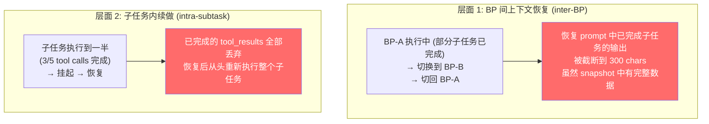

### 1.2 用户场景

用户同一 session 内运行"市场调研报告"BP (3 个子任务: 市场调研 → 数据分析 → 报告生成)。

**场景 A (层面 1)**: "市场调研报告"BP 的第一个子任务已完成，用户切换到"竞品分析"BP 执行一段时间后切回。切回时 LLM 看不到完整的调研结果（恢复 prompt 截断到 300 chars）。

**场景 B (层面 2)**: "市场调研"子任务执行到一半（已完成 3 次 web 搜索，共需 5 次），用户中断（切走/关闭页面）。恢复后 SubAgent 应基于已有的 3 次搜索结果继续，而不是从头搜索。

### 1.3 核心洞察

两个层面虽然粒度不同，但遵循**同一个生命周期模式**：

```
执行 → 产出制品 → 中断 → 捕获 → 压缩 → 存储 → 恢复 → 注入 → 续做
```

因此可以先抽象出统一的上下文管理模型，再映射到各层面的具体实现。

---

## 二、抽象模型

### 2.1 核心概念

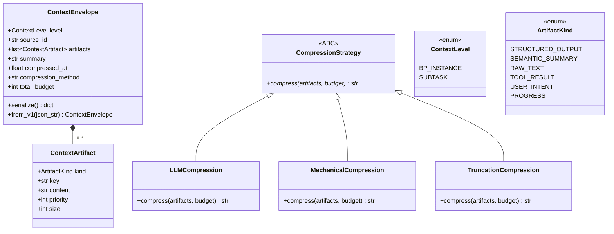

**三个抽象**:

| 抽象 | 形式 | 职责 |
|------|------|------|
| `ContextArtifact` | dataclass | 单个上下文制品，带类型、优先级、内容 |
| `ContextEnvelope` | dataclass | 统一的制品容器，管理预算和序列化 |
| `CompressionStrategy` | ABC | 可插拔的压缩策略 |

### 2.2 制品类型与优先级

| ArtifactKind | 优先级 | 说明 | 预算控制 |
|:---:|:---:|------|:---:|
| `PROGRESS` | 10 | 子任务状态列表 (done/current/pending) | 无限制 (体积小) |
| `USER_INTENT` | 9 | 用户初始输入和偏好 | ≤500 chars |
| `SEMANTIC_SUMMARY` | 8 | LLM 压缩的语义摘要 (决策/偏好/约束) | ≤1000 chars |
| `STRUCTURED_OUTPUT` | 7 | 子任务 conformed JSON 输出 | ≤4000 chars/项 |
| `RAW_TEXT` | 3 | SubAgent 完整回复文本 | ≤3000 chars/项 |
| `TOOL_RESULT` | 2 | 单个工具调用结果 | ≤2000 chars/项 |

预算裁剪规则: 当总量超过 `total_budget` 时，从最低优先级开始截断或丢弃。

### 2.3 生命周期

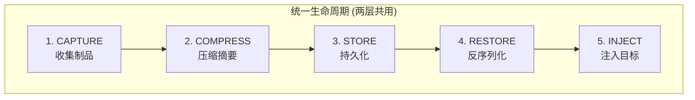

```mermaid
flowchart TB
    subgraph 层面1["层面 1: BP 间"]
        C1["CAPTURE<br/>subtask_outputs<br/>conversation messages<br/>user_intent"]
        M1["COMPRESS<br/>LLM 语义压缩<br/>+ mechanical fallback"]
        S1["STORE<br/>snap.context_summary<br/>(JSON string)<br/>→ session.metadata"]
        R1["RESTORE<br/>ContextEnvelope.from_v1()"]
        I1["INJECT<br/>恢复 prompt →<br/>conversation messages"]
        C1 --> M1 --> S1 --> R1 --> I1
    end

    subgraph 层面2["层面 2: 子任务内"]
        C2["CAPTURE<br/>tool_results<br/>(挂起时捕获)"]
        M2["COMPRESS<br/>截断压缩<br/>(≤2000 chars/项)"]
        S2["STORE<br/>snap.subtask_partial_results<br/>→ session.metadata"]
        R2["RESTORE<br/>从 snap 直接读取"]
        I2["INJECT<br/>已完成进展 →<br/>delegation message"]
        C2 --> M2 --> S2 --> R2 --> I2
    end
```

### 2.4 两层对照

| 维度 | 层面 1: BP 间 | 层面 2: 子任务内 |
|------|:---:|:---:|
| 执行单元 | BP 实例 | SubAgent |
| 触发时机 | bp_switch_task / 新 bp_start | BP 挂起时 SubAgent 正在执行 |
| 主要制品 | STRUCTURED_OUTPUT, SEMANTIC_SUMMARY, PROGRESS, USER_INTENT | TOOL_RESULT |
| 压缩策略 | LLM 语义 (主) + 机械 (降级) | 截断 (tool_results 已有界) |
| 总预算 | 15000 chars | 8000 chars |
| 存储位置 | `snap.context_summary` (JSON string) | `snap.subtask_partial_results` (list) |
| 是否持久化 | 是 (session.metadata) | 是 (session.metadata) |
| 注入目标 | conversation messages | delegation message |

### 2.5 设计决策: ABC vs 概念模型

| 抽象 | 形式 | 理由 |
|------|------|------|
| `CompressionStrategy` | 正式 ABC | 已有 3 种压缩路径混在一个方法的 if/else 中，抽取后可独立测试 |
| `ContextEnvelope` / `ContextArtifact` | 具体 dataclass | 提供数据契约，使生命周期显式化 |
| 生命周期 (5 phase) | 文档化模式 | 注入步骤差异太大，不适合用 ABC 统一；作为 documented pattern 指导实现 |

---

## 三、数据结构设计

### 3.1 BPInstanceSnapshot (改进后)

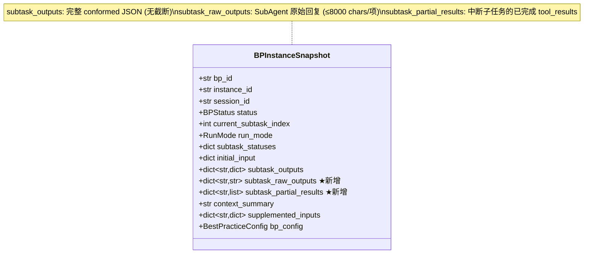

### 3.2 新增字段

| 字段 | 类型 | 层面 | 写入时机 | 清除时机 |
|------|------|:---:|---------|---------|
| `subtask_raw_outputs` | `dict[str, str]` | 1 | 子任务完成时 | BP 完成后保留 |
| `subtask_partial_results` | `dict[str, list[str]]` | 2 | 子任务执行中挂起时 | 子任务重新完成后 |

### 3.3 CompressionStrategy ABC

```python
# engine/compression.py (新文件)

class CompressionStrategy(ABC):
    @abstractmethod
    async def compress(
        self, artifacts: list[ContextArtifact], budget: int,
    ) -> str:
        """将制品列表压缩为摘要字符串，不超过 budget chars。"""
        ...

class LLMCompression(CompressionStrategy):
    """使用 brain.think_lightweight 进行语义压缩。"""
    def __init__(self, brain: Any): ...

class MechanicalCompression(CompressionStrategy):
    """无 LLM 时的机械提取: 取最近 N 条消息文本。"""

class TruncationCompression(CompressionStrategy):
    """纯截断: 按优先级排序后依次截断到 budget。"""
```

压缩降级链 (由 ContextBridge 控制):

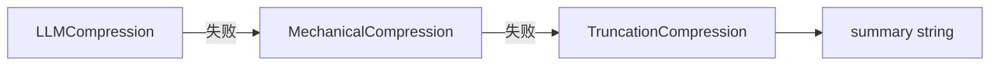

---

## 四、层面 1: BP 间上下文恢复

### 4.1 CAPTURE — 快照数据捕获

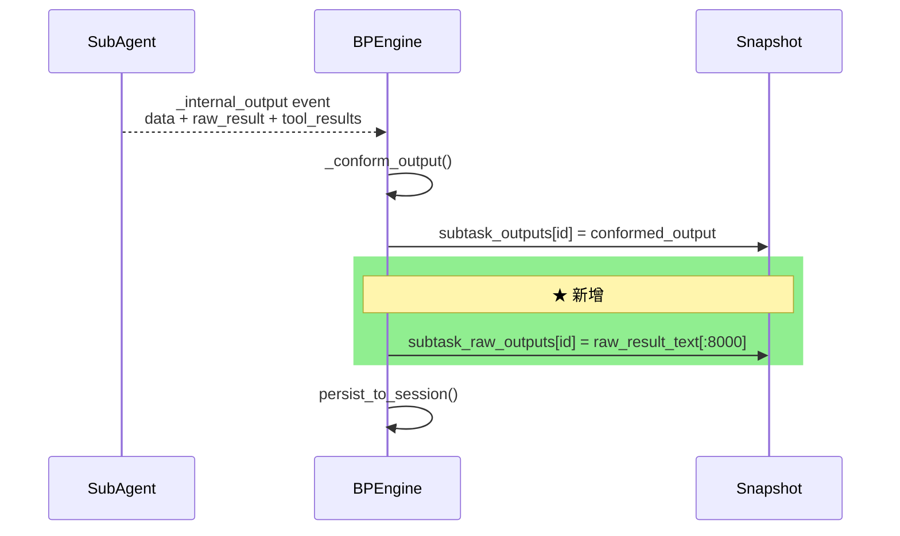

### 4.2 COMPRESS — 压缩流程

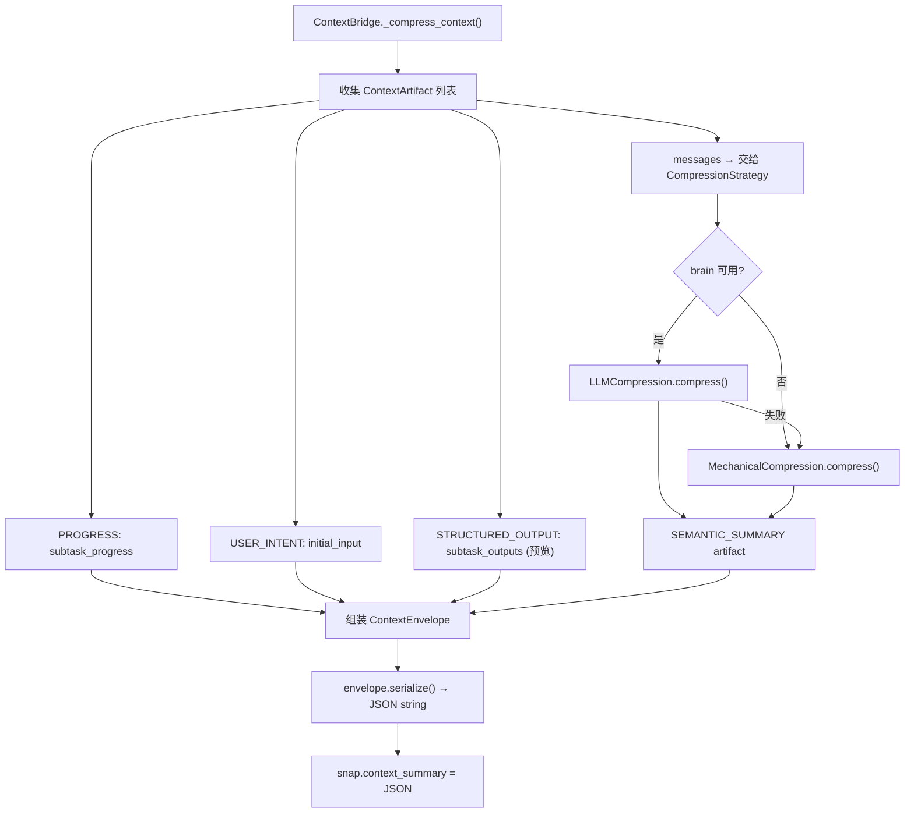

### 4.3 RESTORE + INJECT — 恢复注入

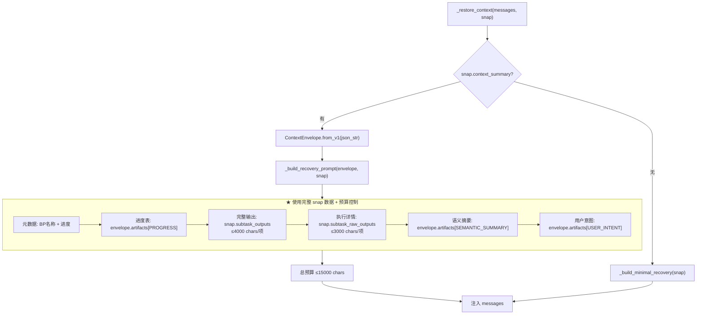

**关键改进**: `_build_recovery_prompt()` 读取 `snap.subtask_outputs`（完整数据）而非 `summary.key_outputs`（300 chars 截断）。

---

## 五、层面 2: 子任务内续做

### 5.1 CAPTURE — 挂起时捕获中间结果

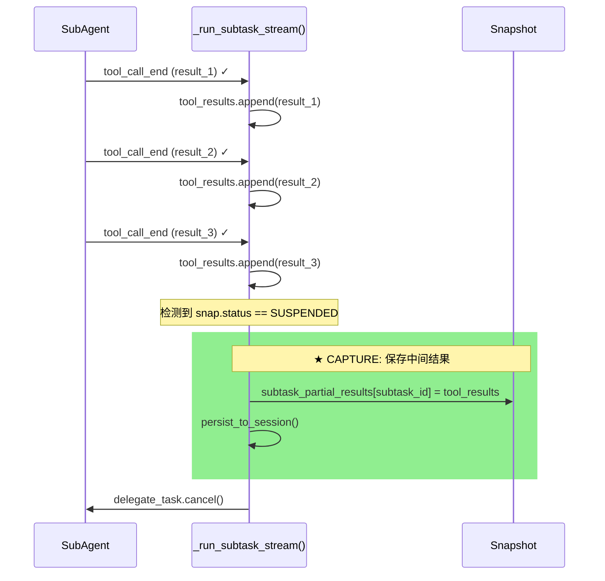

### 5.2 STORE — 持久化

中间结果随 snapshot 一起序列化到 `session.metadata["bp_state"]`:

```json
{
  "subtask_partial_results": {
    "research": [
      "web_search result: 2025年中国咖啡市场规模达3500亿...",
      "web_search result: 瑞幸咖啡门店数超20000家...",
      "web_search result: 现磨咖啡占比从30%提升至45%..."
    ]
  }
}
```

### 5.3 RESTORE + INJECT — 续做注入

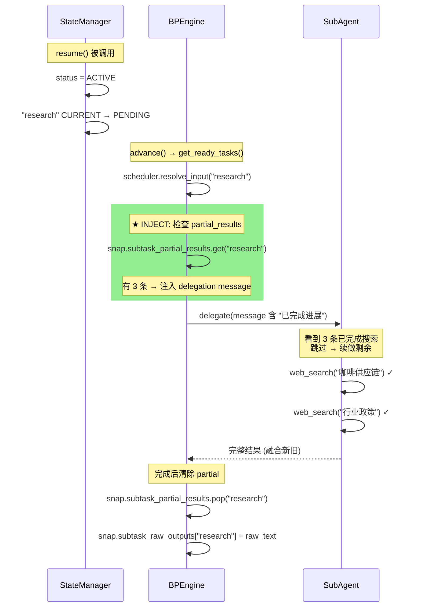

### 5.4 Delegation Message 格式 (含续做)

``` 
## 最佳实践任务: 市场调研报告
### 当前子任务: 市场调研

### 已完成进展 (续做)
以下工具调用已在之前的执行中完成，请勿重复执行:
- 工具结果 1: 2025年中国咖啡市场规模达3500亿元，同比增长15%...
- 工具结果 2: 瑞幸咖啡门店数超20000家，星巴克约7000家...
- 工具结果 3: 现磨咖啡占比从30%提升至45%，外卖咖啡年增速40%...

请基于以上已有结果，继续完成剩余工作。

### 输入数据

{"topic": "咖啡行业调研"}

### 输出格式要求
...
```

### 5.5 Bug 修复: resume() 重置 CURRENT

当前 `LinearScheduler.get_ready_tasks()` 只返回 `PENDING/STALE/None` 状态的子任务。如果子任务在 `CURRENT` 状态时被挂起，恢复后不会被重新调度。

修复: `state_manager.resume()` 中将 `CURRENT` 重置为 `PENDING`。

---

## 六、完整端到端流程

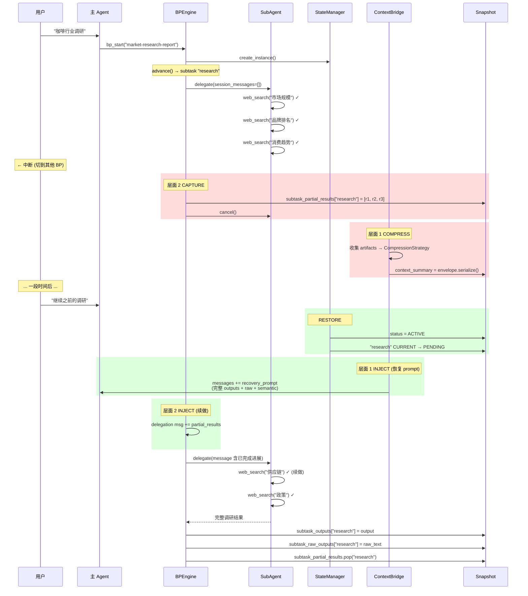

---

## 七、改动文件清单

| 文件 | 改动 |
|------|------|
| `models.py` | 新增 `ContextLevel`, `ArtifactKind`, `ContextArtifact`, `ContextEnvelope` dataclass; `BPInstanceSnapshot` 新增 `subtask_raw_outputs` + `subtask_partial_results` |
| `engine/compression.py` ★新文件 | `CompressionStrategy` ABC + `LLMCompression` + `MechanicalCompression` + `TruncationCompression` (从 context_bridge 提取) |
| `engine/context_bridge.py` | 重构: 使用 `ContextEnvelope` + `CompressionStrategy`; `_build_recovery_prompt` 使用完整 snap 数据; 预算常量 |
| `engine/state_manager.py` | `resume()` 重置 CURRENT→PENDING |
| `engine/core.py` | 挂起保存 partial_results; 完成保存 raw_outputs + 清除 partial; `_build_delegation_message` 注入续做上下文 |
| `engine/__init__.py` | 导出新的 compression 模块 |
| `tests/.../test_models.py` | 新字段 + ContextEnvelope 序列化 |
| `tests/.../test_compression.py` ★新文件 | CompressionStrategy 各实现测试 |
| `tests/.../test_context_bridge.py` | 完整输出恢复 + 预算控制 |
| `tests/.../test_state_manager.py` | resume 重置 CURRENT |
| `tests/.../test_engine.py` | partial 保存/清除 + delegation 续做注入 |

---

## 八、实施顺序

1. **models.py** — 新增抽象 dataclass + snapshot 字段 (零影响)
2. **engine/compression.py** — 提取压缩策略 ABC + 实现 (纯提取，无行为变更)
3. **engine/state_manager.py** — resume() 重置 CURRENT (修复 bug)
4. **engine/context_bridge.py** — 重构为使用 ContextEnvelope + CompressionStrategy + 完整恢复
5. **engine/core.py** — 挂起捕获 partial + 完成保存 raw + delegation 续做注入
6. **tests/** — 全部测试

---

## 九、验证方案

```bash
pytest tests/unit/bestpractice/ -x -v
ruff check src/seeagent/bestpractice/
mypy src/seeagent/bestpractice/
```

### 关键测试

| 测试 | 验证点 |
|------|--------|
| `contextEnvelopeSerializeRoundtripTest` | ContextEnvelope 序列化/反序列化 |
| `contextEnvelopeFromV1CompatibleTest` | 旧 v1 JSON 兼容解析 |
| `llmCompressionWithBudgetTest` | LLM 压缩不超预算 |
| `mechanicalCompressionFallbackTest` | 无 brain 时降级到机械压缩 |
| `recoveryUsesFullSnapshotOutputsTest` | 恢复 prompt 含完整 snap.subtask_outputs |
| `recoveryRespectsBudgetTest` | 总量不超 15000 chars |
| `resumeResetCurrentToPendingTest` | resume() 重置 CURRENT |
| `suspendSavesPartialResultsTest` | 挂起时保存 tool_results |
| `delegationMessageIncludesPartialTest` | 续做时 delegation message 含已完成进展 |
| `completeTaskClearsPartialTest` | 子任务完成后清除 partial |
